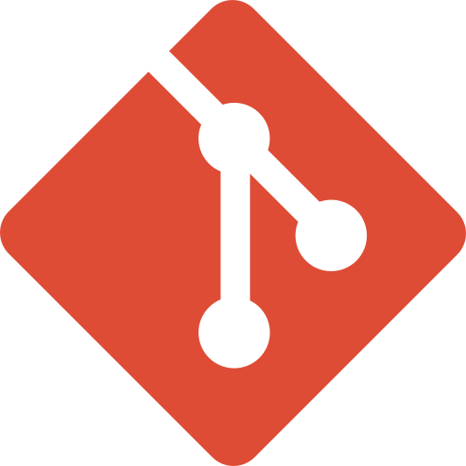

<h1 align="center">Hi 👋, I'm Amirhossein </h1>

<h3 align="center">A Software Engineer and Backend Developer 🤩😎</h3>

<h3 align="left">Connect with me:</h3>

  

<h3 align="left">Languages and Tools:</h3>

  
  
  

<h3 align="left">GitHub Stats:</h3>

  

  

